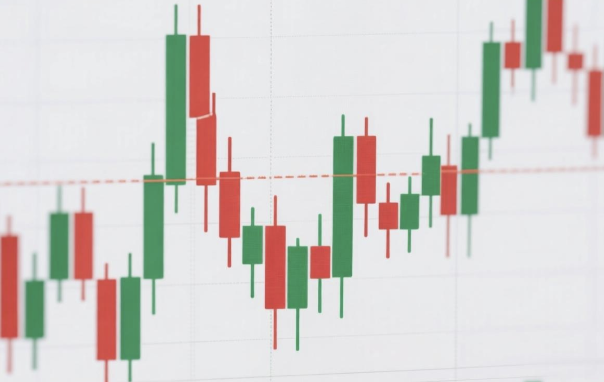
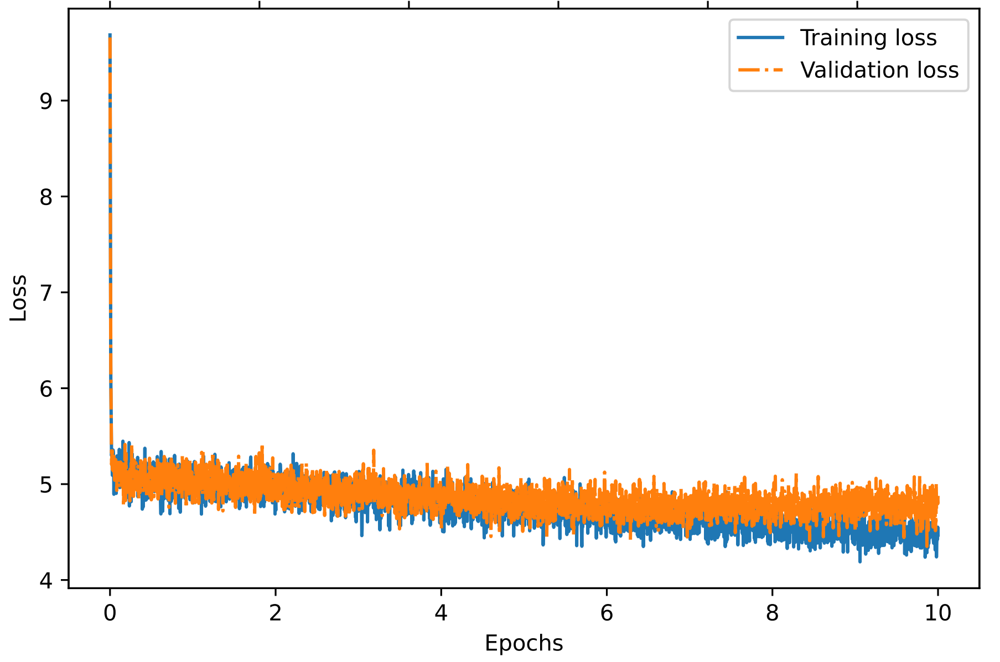
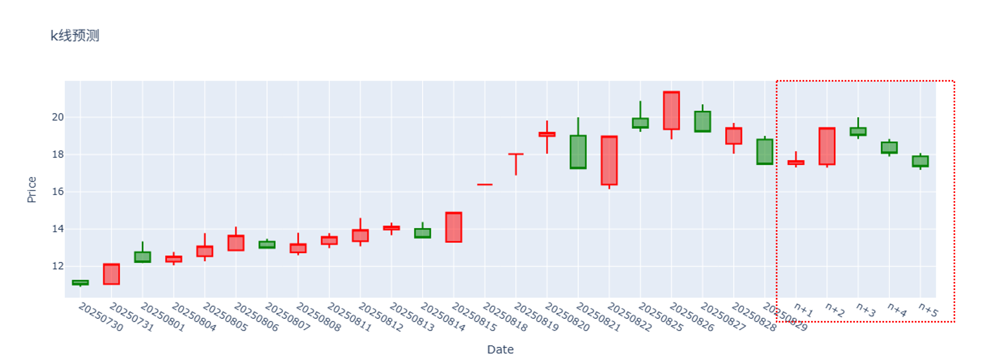
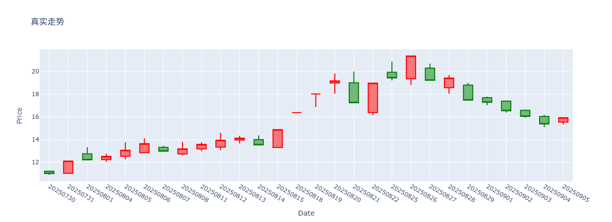
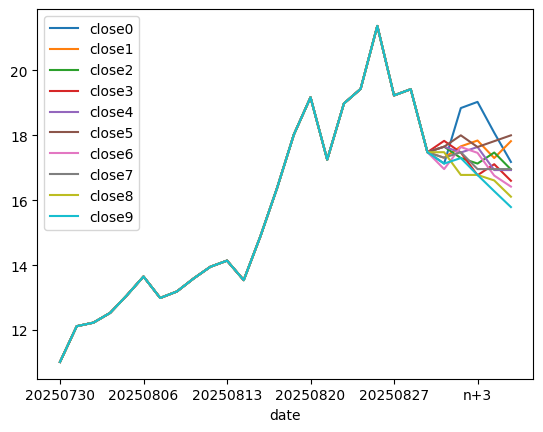

# LKM（Large Kline Model）



一个基于 **Decoder‑only Transformer** 架构的金融时序预测模型，用于预测 K 线 涨跌幅（同时预测open,close,high,low）。可用于k线预测和蒙特卡洛模拟。

## 背景与动机

股票的K线图（如 OHLCV：开盘、最高、最低、收盘价）是分析市场走势的重要工具。本项目使用 Decoder‑only Transformer（基于Qwen3 进行配置）架构，凭借其强大的序列建模能力，直接从历史 K 线中预测未来涨跌。这里必须强调一下，完美预测k线是不可能的。设计该模型的初衷不是为了准确预测k线，而是给我们一个基于统计规律的参考。

## 模型架构

- 基于Qwen3初始化，修改了词表，每个token表示一根k线（开盘、最高、最低、收盘价）相对于前一时刻收盘价的涨跌幅，我们将涨跌幅量化为整数百分点，取值范围为[-10%，-9%，...,0%,..9%,10%]。变动单位为1%。 

- 模型参数为32M。

- 仅使用A股日线数据进行训练。

- 训练上下文长度为27，适合一个月左右的时序预测。

## 训练曲线



## 使用示例

### 1.k线预测
提供近一个月的k线数据，然后让模型预测后五日的k线结果，下面两幅图中，第一幅为预测结果，第二幅为真实值。可以看到，模型无法完美预测k线，但也预测到了一个下跌趋势。





### 2.蒙特卡洛模拟
设置采样温度为1，多次采样，模拟k线未来的走势，下图为根据10次预测结果绘制close得到的曲线。



## 推理与预测

```python
from transformers import Qwen3ForCausalLM,AutoTokenizer
device = torch.device("cuda" if torch.cuda.is_available() else "cpu")
print(f'当前device:{device}')
model = Qwen3ForCausalLM.from_pretrained('csk66/LKM')
model.to(device)
tokenizer = AutoTokenizer.from_pretrained('csk66/LKM',trust_remote_code=True)

def kline_to_token_ids(df ,tokenizer):
    encoded = tokenizer.encode_df(df)
    encoded_tensor = torch.tensor(encoded).unsqueeze(0)  
    return encoded_tensor
def token_ids_to_kline(token_ids, tokenizer):
    flat = token_ids.squeeze(0)  
    return tokenizer.decode(flat.tolist())
def generate(model, tokenizer, device, start_df,max_new_tokens=5):
    model.eval()
    context_size = 22
    encoded = kline_to_token_ids(start_df, tokenizer).to(device)
    with torch.no_grad():
      
        input_ids = encoded[:, -context_size:]
        model_inputs = {"input_ids": input_ids}
        generated_ids = model.generate(
                                    **model_inputs,max_new_tokens=max_new_tokens,do_sample=True,       
    temperature=0.8,     
    top_p=0.9  )
 
        decoded_kline = token_ids_to_kline(generated_ids, tokenizer)
         
        return decoded_kline

data_list = [
    {'date': '2025-08-23', 'open': 120.0, 'high': 125.0, 'low': 119.5, 'close': 123.0},
    {'date': '2025-08-24', 'open': 123.0, 'high': 126.5, 'low': 122.0, 'close': 122.5},
    {'date': '2025-08-25', 'open': 124.5, 'high': 128.9, 'low': 121.1, 'close': 127.3}
]
df = pd.DataFrame(data_list)  # 替换为你要预测的df
max_new_tokens = 5
kline = generate(model, tokenizer, device, df,max_new_tokens)
new_close = df['close'].values[-1]
print(f'last close:{new_close}\n') #第一天的close作为基准点，用于计算后续涨跌幅
pred_list = []
for i,k in enumerate(kline[-max_new_tokens:]):
    dic = {}
    dic['date'] = f'n+{i+1}'
    pcts = k.split(',')
    dic['open'] = round(new_close*(1+float(pcts[0])/100),2)
    dic['close'] = round(new_close*(1+float(pcts[1])/100), 2)
    dic['high'] = round(new_close*(1+float(pcts[2])/100), 2)
    dic['low'] = round(new_close*(1+float(pcts[3])/100), 2)
    pred_list.append(dic)
    new_close = dic['close']
df_pred = pd.DataFrame(pred_list)
df_with_pred = pd.concat([df, df_pred], ignore_index=True)

df_with_pred['kline_pct'] = ['None']+kline
print(df_with_pred)

```

## 声明

本模型 ("Large Kline Model") 是用于学术研究/实验用途。使用者在以下情况下应自行承担风险：

1. **预测不保证准确性**  
   本模型基于过去的 K 线（open, high, low, close）数据训练，虽经优化但无法保证对未来市场表现有准确预测。市场受到多种因素影响（包括但不限于宏观经济、政策、突发事件、交易费用、滑点等），这些因素本模型可能未能涵盖。能完美预测k线的模型是不存在的！

2. **不构成投资建议**  
   模型所给出的预测不应作为买卖股票、期货、加密货币或其他金融工具的依据。使用者应咨询专业投资顾问，并结合自身风险承受能力做出判断。

3. **对损失不承担责任**  
   如果根据本模型的预测造成任何直接或间接损失，作者不承担任何责任。使用者独立决策并承担由此导致的一切后果。

4. **使用环境与数据差异**  
   本模型在特定市场、时间段与数据集上训练，若用于其他市场、资产或时间周期，其表现可能有显著差异。使用前建议进行验证与回测。

5. **更新与维护**  
   本模型可能随时间失效（drift），作者不保证持续维护或适应未来所有环境。用户若继续使用，应定期评估其效能。